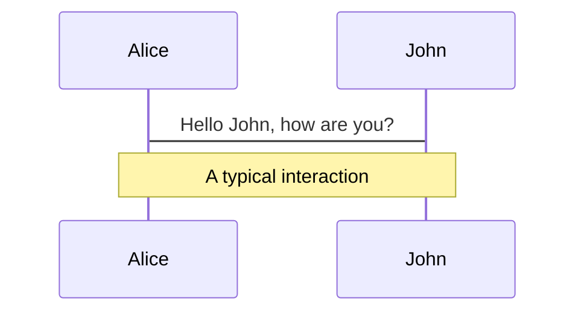
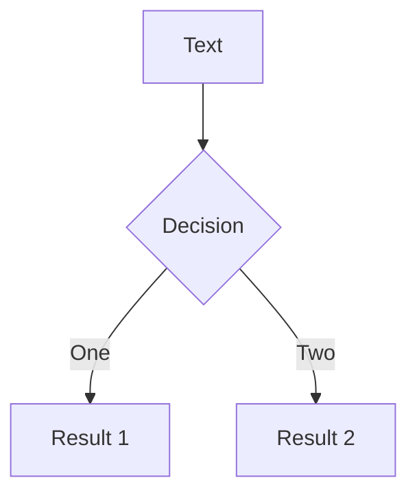
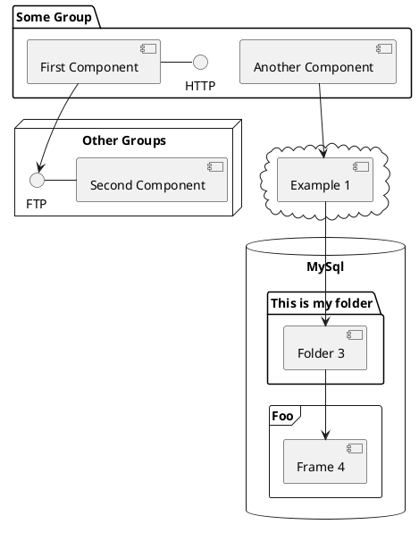

# Introduction to Go Generics

Denys Vitali - Data, Analytics & AI Engineer @ Swisscom
---
layout: image-right
background-size: contain
image: ./pictures/denysvitali-gh.png
---
# About Me

- Denys Vitali
- ❤️ Open Source
- Favorites Languages
  - Go
  - Rust
- Twitter: @DenysVitali

---
layout: image-right-small
background-size: contain
image: ./pictures/denysvitali-swisscom-go.png
---
# About Me @ Swisscom

- Data, Analytics & AI Engineer
- Mostly doing DevOps stuff
- I write lots of CLIs
- Lots of contributions to Open Source, whenever possible
- Lots of Go

---
layout: image-right-small
image: ./pictures/rotterdam-wtc.jpg
---

# About Swisscom

- 🇨🇭 Major Telecommunications Provider
- 👨‍💼 18k employees
- 📍 Multiple locations across Switzerland
  - Zurich, Bern, Basel, Lausanne, Bellinzona, ...
- 🌍 Multiple locations outside of Switzerland
  - 🇱🇻 DevOps Center - Riga, Latvia
  - 🇳🇱 DevOps Center - Rotterdam, Netherlands
  - 🇺🇸 Swisscom Outpost - California, USA
  - 🇨🇳 Swisscom Outpost - Shangai, China

---

# We're hiring

- Innovative company
- Flexbile working
- Attractive Fringe Benefits
- Education Budget

But more importantly:
- We're also looking for Go Software Engineers!


<p style="text-align: center">
  <a href="https://swisscom.ch/jobs">https://swisscom.ch/jobs</a>
</p>


---
layout: fact
---

# Generics in Go

---
layout: small-title
---

# Why are we talking about generics?


<style>
  img.main-image {
    max-height: 300px;
    margin-top: 2em;
    margin-left: auto;
    margin-right: auto;
  }
</style>

<p style="text-align: center; font-size: 0.8rem;">
  Source: Go Developer Survey 2020 Results
</p>

---
layout: code-slide
---

# Life Before Generics

<ReplitEditor :path="'@denysvitali/go-generics-example-1'" :file="'main.go'" />

---
layout: code-slide
---

# Life After Generics

<ReplitEditor :path="'@denysvitali/go-generics-example-2'" :file="'main.go'" />

---

# Go Playground Example

<div class="editor-background">
  <iframe 
    src="https://play.golang.com/p/HmnNoBf0p1z" 
    height="100%"
    width="100%"
  >
  </iframe>
</div>

<style>
  div.editor-background {
    height: 300px;
    width: 100%;
    background-color: #FFF;
  }
</style>

---

# Themes

Slidev comes with powerful theming support. Themes can provide styles, layouts, components, or even configurations for tools. Switching between themes by just **one edit** in your frontmatter:

<div grid="~ cols-2 gap-2" m="-t-2">

```yaml
---
theme: default
---
```

```yaml
---
theme: seriph
---
```


</div>

Read more about [How to use a theme](https://sli.dev/themes/use.html) and
check out the [Awesome Themes Gallery](https://sli.dev/themes/gallery.html).

---
preload: false
---

# Animations

Animations are powered by [@vueuse/motion](https://motion.vueuse.org/).

```html
<div
  v-motion
  :initial="{ x: -80 }"
  :enter="{ x: 0 }">
  Slidev
</div>
```

<div class="w-60 relative mt-6">
  <div class="relative w-40 h-40">
    
    
    
  </div>

  <div
    class="text-5xl absolute top-14 left-40 text-[#2B90B6] -z-1"
    v-motion
    :initial="{ x: -80, opacity: 0}"
    :enter="{ x: 0, opacity: 1, transition: { delay: 2000, duration: 1000 } }">
    Slidev
  </div>
</div>

<!-- vue script setup scripts can be directly used in markdown, and will only affects current page -->
<script setup lang="ts">
const final = {
  x: 0,
  y: 0,
  rotate: 0,
  scale: 1,
  transition: {
    type: 'spring',
    damping: 10,
    stiffness: 20,
    mass: 2
  }
}
</script>

<div
  v-motion
  :initial="{ x:35, y: 40, opacity: 0}"
  :enter="{ y: 0, opacity: 1, transition: { delay: 3500 } }">

[Learn More](https://sli.dev/guide/animations.html#motion)

</div>

---

# LaTeX

LaTeX is supported out-of-box powered by [KaTeX](https://katex.org/).

<br>

Inline $\sqrt{3x-1}+(1+x)^2$

Block
$$
\begin{array}{c}

\nabla \times \vec{\mathbf{B}} -\, \frac1c\, \frac{\partial\vec{\mathbf{E}}}{\partial t} &
= \frac{4\pi}{c}\vec{\mathbf{j}}    \nabla \cdot \vec{\mathbf{E}} & = 4 \pi \rho \\

\nabla \times \vec{\mathbf{E}}\, +\, \frac1c\, \frac{\partial\vec{\mathbf{B}}}{\partial t} & = \vec{\mathbf{0}} \\

\nabla \cdot \vec{\mathbf{B}} & = 0

\end{array}
$$

<br>

[Learn more](https://sli.dev/guide/syntax#latex)

---

# Diagrams

You can create diagrams / graphs from textual descriptions, directly in your Markdown.

<div class="grid grid-cols-3 gap-10 pt-4 -mb-6">







</div>

[Learn More](https://sli.dev/guide/syntax.html#diagrams)


---
layout: center
class: text-center
---

# Learn More

[Documentations](https://sli.dev) · [GitHub](https://github.com/slidevjs/slidev) · [Showcases](https://sli.dev/showcases.html)
